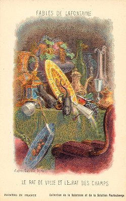
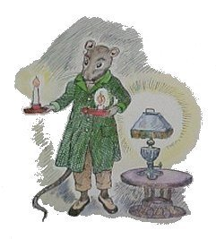
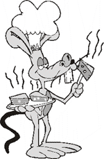
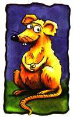
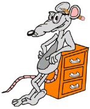

# Le Rat de ville et le Rat des champs

  Autrefois le Rat de ville
  Invita le Rat des champs,
  D'une façon fort civile,
  A des reliefs d'Ortolans.

  
 
  Sur un Tapis de Turqui
  Le couvert se trouva mis.
  Je laisse à penser la vie
  Que firent ces deux amis.

  

  Le régal fut fort honnête,
  Rien ne manquait au festin ;
  Mais quelqu'un troubla la fête
  Pendant qu'ils étaient en train.

  

  A la porte de la salle
  Ils entendirent du bruit :
  Le Rat de ville détale ;
  Son camarade le suit.

  

  Le bruit cesse, on se retire :
  Rats en campagne aussitôt ;
  Et le citadin de dire :
  Achevons tout notre rôt.

  

   C'est assez, dit le rustique ;
   Demain vous viendrez chez moi :
   Ce n'est pas que je me pique
   De tous vos festins de Roi ;

   

   Mais rien ne vient m'interrompre :
   Je mange tout à loisir.
   Adieu donc ; fi du plaisir
   Que la crainte peut corrompre.

   
